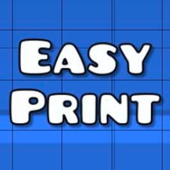

<p align="center"></p>

# EasyPrint

A [Geode](https://geode-sdk.org) mod for Geometry Dash (Windows) that makes **Print Screen** just work: select an area inside the game and it is copied to your clipboard, without crashing, freezing or minimizing the game.

Мод для Geometry Dash на [Geode](https://geode-sdk.org): нажми **Print Screen**, и скриншот игры сразу окажется в буфере обмена. Без вылетов и мороки.

See [about.md](about.md) for the full description and [changelog.md](changelog.md) for changes.

## How it works
- A low-level keyboard hook swallows `Print Screen` while Geometry Dash is the foreground window, so Windows' own snipping tool never steals focus from the game.
- On the next frame, right before `CCEGLView::swapBuffers`, the finished back buffer is read with `glReadPixels` (with a `CCRenderTexture` fallback).
- The frozen frame is shown in an in-game overlay (the level is paused) where you drag out the area to copy. Enter copies everything, Esc cancels.
- The selected area is put on the clipboard as a `CF_DIB` bitmap.

## Building
Every push builds the mod with GitHub Actions (`.github/workflows/build.yml`). Download the `.geode` file from the run's artifacts and put it in `Geometry Dash/geode/mods`.

To build locally with the [Geode CLI](https://docs.geode-sdk.org/getting-started/geode-cli):

```sh
geode build
```
